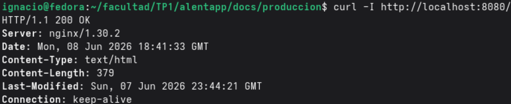
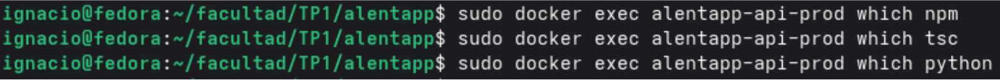
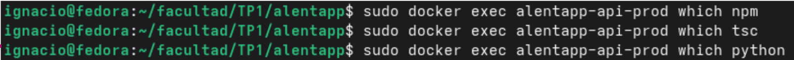
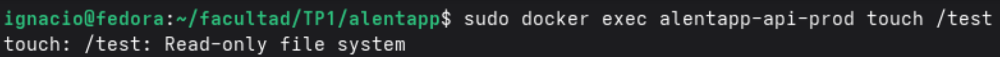
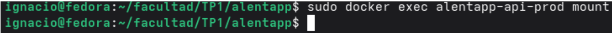
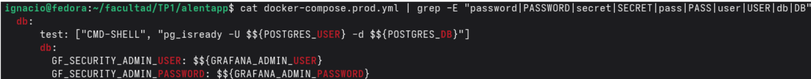
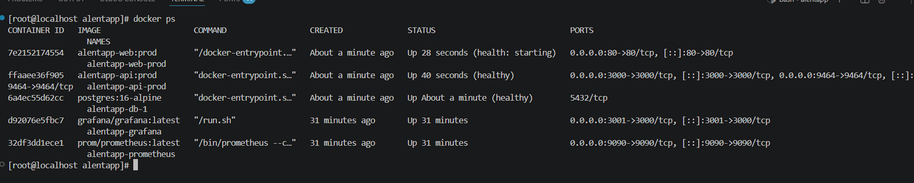

# 4.1 Verificación Técnica

| Métrica | Antes (desarrollo) | Después (producción) | Mejora |
| --- | --- | --- | --- |
| Tamaño imagen API | `api:dev` → Disk usage: 1.5GB | `api:prod` → Disk usage: 644MB | Se redujo el tamaño de Disk usage en aproximadamente un 58% |
| Tamaño imagen web | `web:dev` → Disk usage: 841MB | `api:prod` → Disk usage: 73.5MB | Se redujo el tamaño de Disk usage en aproximadamente un 90% |
| Tiempo de startup API | 129 segundos  | 34 segundos | Hubo una mejora del 74% |
| Memoria API (idle) | `api:dev` → Mem Usage: 199.5MiB | `api:prod` → Mem Usage: 54.83 MiB | Hubo una mejora del 72% en el uso de la memoria |
| Endpoints accesibles | `curl` `:3000/api/v1/socios, :3000/api/v1/payments, :3000/api/v1/equipment-loans, :3000/api/v1/sports, :3000/api/v1/enrollments, :3000/api/v1/lockers, :3000/api/v1/disciplines` | :`3000/api/v1/socios, :3000/api/v1/payments, :3000/api/v1/equipment-loans, :3000/api/v1/sports, :3000/api/v1/enrollments, :3000/api/v1/lockers, :3000/api/v1/disciplines, :9464/metricas, :3001` (grafana), `:3000/health` | La API se mantiene accesible en ambos entornos |
| Frentend via nginx | No aplica en desarrollo. El frontend no se servía mediante nginx | ` curl localhost/` | El frontend queda correctamente servido por nginx en producción |

Métricas de Nginx

# 4.2 Verificación de Seguridad

### La API corre con usuario no-root

### No hay `npm/tsc/python` en la imagen final

### Read-only filesystem activo (`docker exec ... touch /test` falla)

### Capabilities mínimas (no se puede `ping`, `mount`, etc.)

### Variables sensibles via `.env`, no hardcodeadas

### Healthchecks funcionando (`docker ps` muestra "healthy")

# 4.3 Verificación de Observabilidad

### OpenTelemetry exporta métricas en :9464/metrics

### Prometheus scrapea correctamente el endpoint OTLP

### Grafana tiene al menos un datasource Prometheus configurado

### El dashboard RED tiene 6 paneles funcionales y Los gráficos responden al tráfico generado

### Las métricas de error reflejan los 4xx/5xx

# 4.4 Documentación de decisiones

### Arquitectura final: diagrama o descripcion de como quedo el sistema

#### 1. Frontend (Capas de Cliente)

- **Tecnologías:** Está desarrollado utilizando React como librería de interfaz de usuario, optimizado con Vite como empaquetador (lo que asegura un desarrollo y compilación rápidos), y Chakra UI como framework de componentes para el diseño y los estilos.
- **Interacción:** El Usuario interactúa directamente con esta capa visual.

#### 2. Elemento Compartido: @alentapp/shared DTOs

- Este es un punto clave del diseño. Es un paquete o módulo compartido que contiene los DTOs (Data Transfer Objects).
- Se conecta tanto con el Frontend como con los Fastify Controllers en el Backend. Esto garantiza que los datos que viajan entre el cliente y el servidor mantengan exactamente la misma estructura y validación, evitando errores de comunicación y tipado.

#### 3. Backend (Arquitectura Hexagonal)

El backend está estructurado bajo los principios de la Arquitectura Hexagonal (Ports and Adapters), lo que divide el código en capas muy bien definidas para aislar la lógica de negocio de la tecnología externa:
- **Controladores (Fastify Controllers):** Actúan como el punto de entrada de las peticiones HTTP que vienen del Frontend. Utilizan el framework Fastify (conocido por su alta velocidad y bajo rendimiento de sobrecarga).
- **Capa de Aplicación (Application - Casos de Uso):** Los controladores delegan la responsabilidad a los Casos de Uso (Use Cases). Aquí se define qué hace la aplicación (la coreografía de las acciones), sirviendo de puente entre el mundo exterior y las reglas de negocio.
- **Capa de Dominio (Domain):** Contiene el núcleo de la aplicación: el Dominio, Puertos (Interfaces) y Validadores. Es la capa más interna y pura; no depende de ninguna base de datos ni framework. Los casos de uso invocan estas reglas y se comunican con el exterior mediante los "Puertos".
- **Capa de Infraestructura (Infrastructure):** Aquí se implementan los detalles técnicos y herramientas externas que el Dominio necesita pero de las que no quiere acoplarse.
Repositorios Prisma: Implementación concreta de los puertos de acceso a datos utilizando el ORM Prisma.
- **OpenTelemetry:** Herramienta de infraestructura utilizada para la recolección de métricas, trazas y telemetría del backend.

##### 4. Base de Datos y Almacenamiento

- **PostgreSQL:** Es la base de datos relacional principal del sistema. Los Repositorios Prisma de la capa de infraestructura se conectan directamente aquí para persistir y consultar la información de la aplicación.

#### 5. Monitoreo y Observabilidad

El sistema cuenta con un ecosistema robusto para vigilar la salud y el rendimiento de la aplicación en producción:
- **Prometheus:** Centraliza y recopila las métricas del sistema. Recibe datos tanto de la infraestructura del backend (a través de OpenTelemetry) como de Grafana.
- **Grafana:** Herramienta de visualización que se conecta a Prometheus para mostrar tableros (dashboards), gráficos y alertas en tiempo real sobre el estado del backend y el comportamiento de la app.

### Decisiones técnicas: por qué eligieron cada approach (multi-stage, nginx, OTLP, etc.)

Para soportar la arquitectura del sistema, el diseño de la infraestructura y el flujo de despliegue se pensó bajo un principio de separación de entornos, optimizando el rendimiento en producción y la agilidad en el desarrollo.

#### 1. Multi-stage Docker builds vs single-stage

- **Desarrollo:** Se utiliza un enfoque Single-stage donde se instala todo con un `npm install` estándar. Esto simplifica la reconstrucción local y mantiene las herramientas de soporte activas para el desarrollador.
- **Producción:** Se implementan pipelines de 3 a 4 etapas (`deps $\rightarrow$ build $\rightarrow$ runtime`). En la API, además, se realiza una limpieza agresiva de node_modules eliminando artefactos innecesarios de Prisma, React y tests. Esto reduce el tamaño final de la imagen entre un 70% y un 80%, acelerando los despliegues.

#### 2. Node.js vs Nginx como runtime en Web

- **Desarrollo:** Se ejecuta Node 20 corriendo el servidor de desarrollo de Vite, lo que proporciona un entorno interactivo indispensable para programar (con características como hot-reload).
- **Producción:** Se utiliza Nginx 22-alpine como runtime final. El contenedor ya no ejecuta Node, sino que solo sirve los archivos estáticos compilados. Esto cambia la arquitectura por completo: pasa de ser un servidor dinámico de desarrollo a un esquema tipo CDN, minimizando el uso de memoria RAM.

#### 3. npm install vs npm ci --omit=dev

- **Desarrollo:** Se usa `npm install` incorporando todas las dependencias de desarrollo (devDependencies) necesarias para el día a día, como TypeScript, ESLint y los ejecutores de pruebas.
- **Producción:** Se utiliza `npm ci --omit=dev` en la etapa de construcción. Esto garantiza una reproducibilidad exacta del entorno basada estrictamente en el package-lock.json y evita inyectar herramientas de desarrollo innecesarias en el contenedor de ejecución.

#### 4. Montaje de volúmenes vs imágenes selladas y seguridad hardening

- **Desarrollo:** Se configuran volúmenes montados (`.:/app`) para permitir el hot-reload en tiempo real, manteniendo un sistema de archivos con permisos completos de lectura y escritura.
- **Producción:** Se eliminan los volúmenes, dejando contenedores inmutables con el sistema de archivos en modo read-only. Se aplica un hardening estricto de seguridad: remoción de privilegios del kernel (`cap_drop: ALL, sumando solo cap_add: NET_BIND_SERVICE`), configuración de `no-new-privileges:true` y ejecución obligatoria bajo usuarios no-root.

#### 5. Healthchecks y orquestación con dependencias en cascada y límites de recursos

- **Desarrollo:** Se manejan healthchecks simples (cada 5 segundos) orientados a la disponibilidad rápida, sin imponer límites de CPU/RAM ni restricciones en la retención de logs.
- **Producción:** Se establece una orquestación controlada. Los healthchecks funcionan en cascada (`$\text{base de datos} \rightarrow \text{api} \rightarrow \text{web}$`) para asegurar que los servicios dependientes estén listos antes de levantar el siguiente. Se asignan límites y reservas estrictas de CPU y memoria, los logs se rotan automáticamente (máximo 10MB) para no saturar el disco, y las variables críticas se inyectan de forma segura mediante archivos env_file.

#### 6. PrometheusExporter nativo en lugar de OTLP + OpenTelemetry Collector

- **Enfoque:** En el módulo Telemetry.ts del Backend, se utiliza el PrometheusExporter expuesto directamente en el puerto 9464, en lugar de implementar OTLP para enviar las métricas a un Collector centralizado.

- **Justificación:** Esto simplifica significativamente la arquitectura de observabilidad al eliminar un componente intermedio en la infraestructura. El flujo de datos queda directo: `API $\rightarrow$ Prometheus $\rightarrow$ Grafana`. El sacrificio técnico de este enfoque es la flexibilidad, ya que no permite procesar, transformar o re-exportar las métricas a múltiples herramientas o backends en simultáneo.

### Problemas encontrados: qué les costó resolver y cómo lo hicieron

1. **`docker.compose.prod` y `dockerfile.prod` en API:** a la hora de querer levantar el `docker.compose.prod.yml` (y los dockerfile correspondiente a API y Web), nos encontramos con un problema de importación que provenía del archivo `app.js`. Cuando ejecutamos `docker compose -f docker.compose.prod.yml up –build` nos encontramos con el inconveniente de que la API “no levantaba”; despues de varias horas buscando el error, nos dimos cuenta que no se encontraba ni en el docker comopose ni en el dockerfile, sino que este provenia del `app.js`, porque allí la importacion (para iniciarlo) del archivo estaba dada por `if (process.argv[1] && (process.argv[1].endsWith('app.ts')` y nosotros lo estabamos llamando como '`app.js`', por ende para evitar que haya problemas, decidimos agregarle un or a la condicion del if, asi se puede importar al archivo de cualquiera de las dos maneras, sin que haya error: `if (process.argv[1] && (process.argv[1].endsWith('app.ts') || process.argv[1].endsWith('app.js')))`.

2. **Problemas de importaciones:** al momento de probar los archivos `dockerfile.prod` (tanto en API como Web) nos empezaron a saltar problemas de sintaxis en la gran mayoría de los archivos. Estos “errores” jamás se dieron a conocer durante las etapas anteriores, por lo que nos vimos bastante sorprendidos y desconcertados ya que TypeScript nunca nos lo marcó. Ante esta problemática, empezamos a buscar y solucionar los errores en el codigo hasta que los dockerfile ejecutaron la transpiración sin problema.

### Capturas de pantalla: del dashboard RED funcionando con datos

